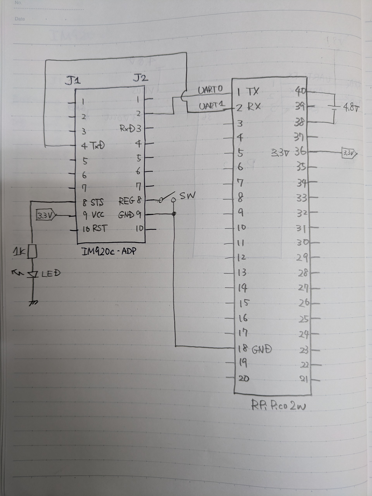

# IM920sl_Pico2

## 配線図
親機・子機共通



## 設定
### 送信側（親機）の設定
ソフトウェアリセット
```
SRST
> IM920sL Ver.XX.XX
```
書き込み許可
```
ENWR
> OK
```
ノード番号設定
```
STNN 0001
> OK
```

### 送信側（親機）の設定
ソフトウェアリセット
```
SRST
> IM920sL Ver.XX.XX
```
書き込み許可
```
ENWR
> OK
```
ノード番号設定
```
STNN 0002
> OK
```

### ペアリング
親機と子機を隣り合わせて置く必要あり

親機
```
STGN
> OK
```
子機
```
STGN
> OK
```


子機
```
> GRNOREGD
```
ペアリング成功


## 参考
- 920MHzに比べると国技館のBluetoothはカスや https://zenn.dev/kokastar/articles/0857fac6ddf5b4
- IM920/IM920sLでPCとPC間で送受信してみる https://qiita.com/mml/items/e2f009179a8cb154c480
